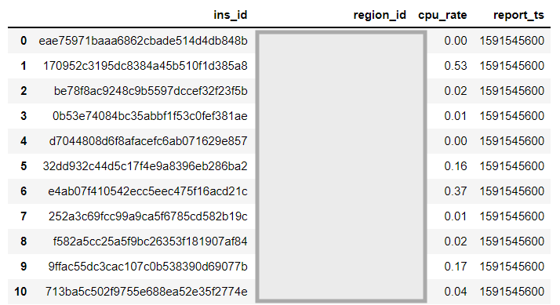
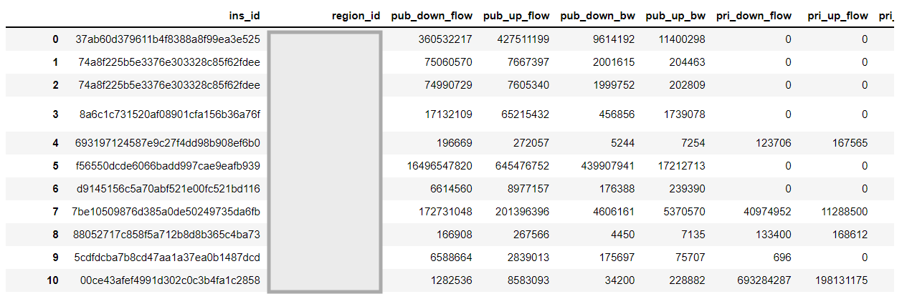
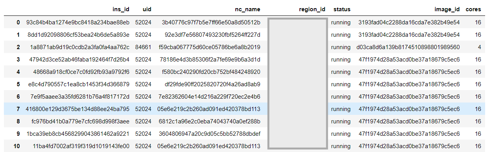
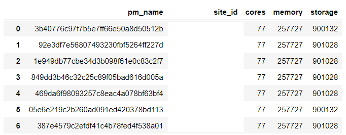

# EdgeWorkloadsTraces

Paper: [IMC'21] [From Cloud to Edge: A First Look at Public Edge Platforms](https://arxiv.org/abs/2109.03395)

*Dataset list*

- **NEP-small**: The workloads traces of 14 edge sites of China's largest public edge platform during June 2020 (5-min per record).
- **NEP-large**: The data of 139 edge sites of China's largest public edge platform during June 2020 (5-min per record). (*In this data set, we additionally  provide three-month continuous records for bandwidth trace, but the granularity is 1 hour.*)

## Dataset description

Each dataset contains the workloads traces (CPU, memory, storage, bandwidth) at virtual machine (VM) granularity from a large-scale edge cloud platform in China.

Specifically, each dataset consists of five CSV files.

 - **T\_INSTANCE\_CPU**: the CPU usage data of each VM;
 - **T\_INSTANCE\_BANDWIDTH**: the bandwidth (both uplink and downlink) usage data of each VM;
 - **T\_NET\_DISCOVER\_MTR**: the RTT among edge sites;
 - **e\_vm\_instance**: the VM affiliation table, including customer id, mirror id, specifications, etc;
 - **e_nc**: physical machine(PM) ID, the CPU, memory, and storage size of each physical machine.

## Data sample

### T\_INSTANCE\_CPU.csv

> (1) `ins_id` is the VM ID;
> (2) `region_id` is the edge site ID;
> (3)`cpu_rate` is the CPU usage. For example, 0.6 indicates 60%;
> (4) `report_ts` is the Unix timestamp of data collection.

### T\_INSTANCE\_BANDWIDTH.csv

> `pub` is the public network, `pri` is the internal network, `up` is the uplink, `down` indicates the downlink, `bw` is the bandwidth usage (bps), and `flow` is the number of flows

### T\_NET\_DISCOVER\_MTR.csv

### e\_vm\_instance.csv

> `uid` is the customer ID; `nc_name` is the physical machine (PM) ID where the VMs are hosted; `status` is the status of instance; `image_id` is the system image ID used by the instance;`os_type` is the OS type; `os_name` is the OS name.

### e\_nc.csv

> `cores`, `memory`, and `storage` are the number of CPU cores, memory size (MB), and disk size (MB) of the physical machine, respectively.

## Statement

1. The data can be only used for research purpose.
2. The data can not be shared offline.

*To request the data, please submit a form here: https://forms.gle/j3QDp9qtCVyrcTwm9*, and we will response AFAP.
Contact Mengwei Xu (mwx@bupt.edu.cn) for any inquiry.
